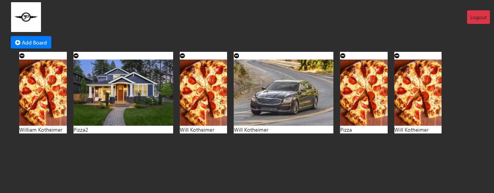
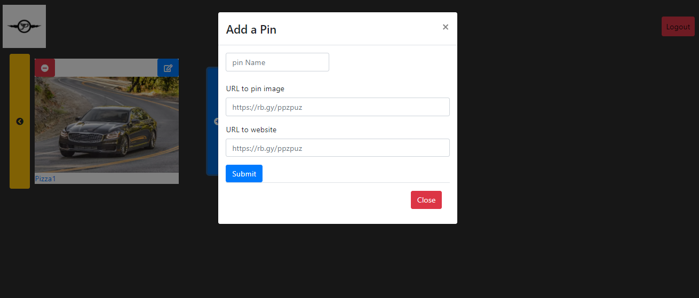

# Pinterest

## Motivation
The motivation behind this project is to mock up a dashboard that 
mimics Pinterest and which has crud capabilities and uses an api (in this case, firebase)

## Build status
MVP

## Code Style
Javascript ES6, Jquery, HTML5, CSS3
Bootstrap, Firebase, Axios

## ERD

[https://app.lucidchart.com/lucidchart/47ce6966-9bc7-4abe-8a99-7284c05fe3a7/edit?shared=true&page=0_0#?folder_id=home&browser=icon](https://app.lucidchart.com/lucidchart/47ce6966-9bc7-4abe-8a99-7284c05fe3a7/edit?shared=true&page=0_0#?folder_id=home&browser=icon)

## Figma

[https://www.figma.com/file/oY5oI8BwFVNAjzmE8YR79G/Pinterest-Clone?node-id=0%3A1](https://www.figma.com/file/oY5oI8BwFVNAjzmE8YR79G/Pinterest-Clone?node-id=0%3A1)

## How to test

`git clone [branch]`
`git fetch origin development`
`git checkout development`
cd into folder
`npm install`
`npm start`

## URL

[Hosting URL: https://pinterest-32a4e.web.app](Hosting URL: https://pinterest-32a4e.web.app)

## Screenshots:




## Features
This site has a way to do crud functionality on Boards and Pins.
There is an ability to create and delete a board, create and delete
a pin and edit a pin to choose a different board. It also has basic
google authentication.

## Code Example

```
/* Gets boards that have the userID attached to them */
const boardsInfo = (userId) => new Promise((resolve, reject) => {
  axios.get(`${baseUrl}/boards.json?orderBy="Uid"&equalTo="${userId}"`)
    .then((response) => {
      const boards = response.data;
      const board = [];
      if (boards) {
        Object.keys(boards).forEach((boardId) => {
          board.push(boards[boardId]);
        });
      }
      resolve(board);
    }).catch((error) => reject(error));
});

```

## Team

[Will Kotheimer](https://github.com/willkotheimer)
